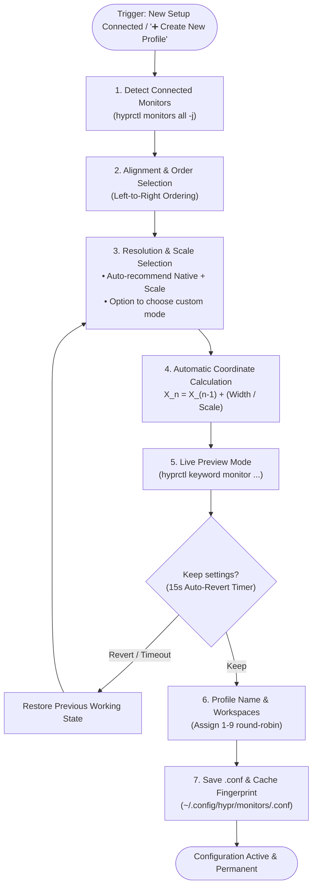

# Interactive Monitor Setup Wizard Plan

## 1. Overview & Problem Statement
Currently, when a new multi-monitor setup is connected and no profile exists:
- The system falls back to a static, inaccurate template.
- Lowering resolution directly (e.g. Setting a 4K monitor to 1440p) causes blurriness due to hardware panel interpolation.
- There is no guided alignment (ordering displays left-to-right) or live preview with an auto-revert safety net.

### The Anti-Blur Strategy
- **Native Resolution**: Send the panel's native physical resolution (e.g. `3840x2160@60Hz` for 4K).
- **Fractional Scaling**: Use Hyprland's scaling (`scale = 1.50` or `1.25`) to increase window/font sizes without losing crispness.
- **Zero Scaling for XWayland**: Preserve `xwayland { force_zero_scaling = true }` so legacy X11 apps don't blur.

---

## 2. Architecture & Wizard Flow



---

## 3. Step-by-Step Implementation Details

### Step 1: Smart Hardware Detection
- Query `hyprctl monitors all -j`.
- Extract for each connected monitor:
  - Port/connector name (`HDMI-A-1`, `eDP-1`, `DP-1`, etc.).
  - Human-friendly model description (`Samsung U32R59x 32" 4K`, `AU Optronics Laptop 1080p`).
  - Native physical resolution and maximum refresh rate from `availableModes`.
  - Current active resolution and scale.

### Step 2: Physical Alignment & Ordering
- Prompt user via Rofi to arrange displays from left to right:
  - **2 Displays**:
    - `[HDMI-A-1 (Samsung 4K)] on Left ── [eDP-1 (Laptop)] on Right`
    - `[eDP-1 (Laptop)] on Left ── [HDMI-A-1 (Samsung 4K)] on Right`
  - **3+ Displays**: Stepwise selection for far-left, center, and far-right.
- Orientation: Top-aligned horizontal row (`Y = 0`).

### Step 3: Resolution & Scale Selection (Anti-Blur)
For each monitor in order:
1. **Resolution & Refresh Rate**:
   - Pre-select & recommend: Native resolution at highest refresh rate (e.g. `3840x2160@60Hz (Recommended - Sharpest)` or `1920x1080@144Hz (Recommended - High Refresh)`).
   - Allow choosing alternative resolutions from `availableModes`.
2. **Scale / UI Size**:
   - For 4K displays:
     - `1.50 (Recommended - 1440p UI size, Razor-Sharp Text)`
     - `1.25 (More screen real estate)`
     - `1.75 (Larger UI/Text)`
     - `1.00 (100% Unscaled - Tiny UI)`
     - `Custom...`
   - For 1080p displays:
     - `1.00 (Recommended - Native 100%)`
     - `1.25 (Slightly larger)`

### Step 4: Automatic Logical Coordinate Math
Hyprland coordinates are defined in **logical space**:
$$\text{Logical Width} = \frac{\text{Physical Width}}{\text{Scale}}$$

The wizard computes $X$ positions automatically:
- **Monitor 1 (Leftmost)**:
  - Position: `0x0`
  - Logical Width: $3840 / 1.50 = \mathbf{2560}$
- **Monitor 2 (Right)**:
  - Position: $\mathbf{2560\text{x}0}$
  - Logical Width: $1920 / 1.00 = 1920$
- **Monitor 3 (if present)**:
  - Position: $(2560 + 1920)\text{x}0 = \mathbf{4480\text{x}0}$

### Step 5: Live Preview with 15-Second Auto-Revert Safety Net
- Apply test rules dynamically:
  ```bash
  hyprctl keyword monitor <port>,<res>@<hz>,<x>x<y>,<scale>
  ```
- Pop up a Rofi confirmation modal with a countdown timer:
  > **"Testing new layout. Keep this configuration? (Reverting in 15s)"**
  > - `[✓] Keep Configuration`
  > - `[✗] Revert to Previous`
- If user chooses "Revert", presses `Esc`, or does not respond within 15 seconds, the previous configuration is automatically restored via `hyprctl reload`.

### Step 6: Workspace Allocation & Profile Generation
- Prompt for profile name (prefilled with e.g. `desk-samsung-2-monitors`).
- Allocate workspaces 1–9 round-robin across monitors.
- Generate and save `~/.config/hypr/monitors/<name>.conf`.
- Link active config in `~/.config/hypr/monitors.gen.conf`.
- Save MAC + monitor fingerprint into `~/.config/hypr/.cache/monitor_profile_cache.json`.
- Send desktop notification via `notify-send`.

---

## 4. Files to Create / Modify

| File | Action | Description |
|---|---|---|
| `hypr/.config/hypr/scripts/monitor_wizard.sh` | **Create** | Dedicated wizard implementing detection, alignment, scale/mode selection, preview timer, and coordinate math. |
| `hypr/.config/hypr/scripts/monitor_profile_manager.sh` | **Modify** | Hook `monitor_wizard.sh` into `create_new_profile` and add a menu entry for `🪄 Setup Wizard`. |
| `hypr/.config/hypr/monitors/template.conf` | **Update** | Update template comments with fractional scaling and logical coordinate examples. |
